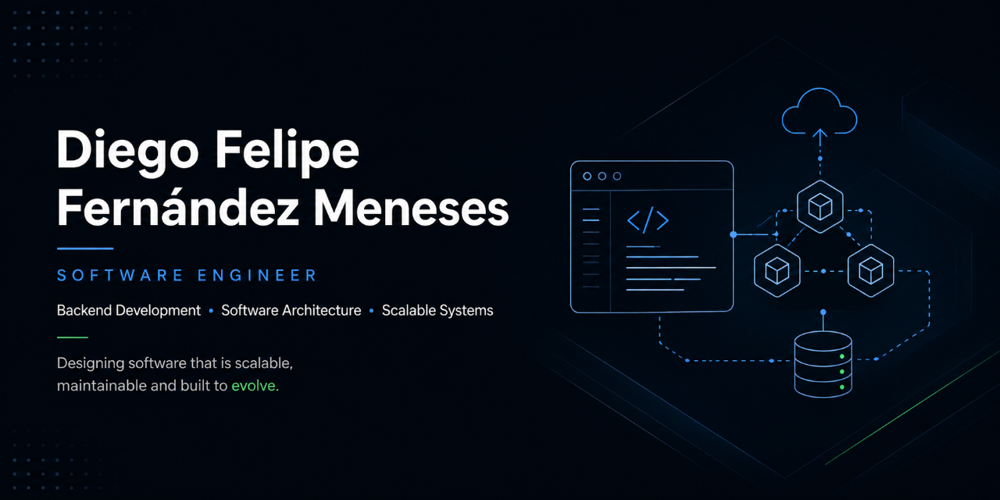

  
  
  

 

# 👋 Welcome | Bienvenido

🇺🇸 **English**

I'm a **Software Engineer** focused on designing scalable backend systems, distributed architectures and enterprise software solutions.

My interests include **Backend Development**, **Software Architecture**, **Microservices** and **AI-Assisted Software Engineering**. I enjoy transforming business requirements into maintainable, secure and scalable software through modern engineering principles.

---

🇪🇸 **Español**

Soy **Ingeniero Informático** orientado al diseño de aplicaciones empresariales escalables, arquitecturas distribuidas y soluciones backend modernas.

Mis principales áreas de interés son el **Backend Development**, la **Arquitectura de Software**, la **Arquitectura basada en Microservicios** y el **desarrollo asistido por Inteligencia Artificial**. Disfruto transformar necesidades de negocio en software mantenible, seguro y escalable mediante principios modernos de Ingeniería de Software.

---

# 🚀 About Me

- 🏗 Designing scalable software architectures.
- ⚙ Building backend applications with TypeScript and NestJS.
- 🧩 Interested in distributed systems and microservices.
- 🔐 Focused on secure software design.
- 🤖 Exploring AI-assisted software engineering.
- 📚 Strong believer in technical documentation and continuous learning.

---

# 🎯 Engineering Focus

My professional interests focus on designing software that remains maintainable as it grows.

Current areas include:

- Backend Development
- Software Architecture
- Microservices Architecture
- Distributed Systems
- RESTful API Design
- Authentication & Authorization
- Enterprise Software
- AI-Assisted Software Engineering

I prioritize systems that are:

- Maintainable
- Scalable
- Modular
- Secure
- Clean

---

# 💻 Tech Stack

My primary focus is building scalable backend applications and distributed systems. The following technologies represent the tools and platforms I currently work with and continue to deepen through professional projects and continuous learning.

## 👨‍💻 Programming Languages

  

  

---

## ⚙️ Backend Development

  

  

---

## 🎨 Frontend Development

  

  

---

## 🗄 Databases

  

  

  

---

## 📡 Messaging

  

---

## 🚀 DevOps

  

  

  

---

# 🏛 Software Architecture

I enjoy designing systems that are modular, maintainable and prepared for long-term evolution.

Current architectural approaches include:

- Clean Architecture
- Microservices Architecture
- Distributed Systems
- RESTful APIs
- SOLID Principles
- Design Patterns
- Domain-Driven Design (Learning)
- Event-Driven Communication
- Authentication & Authorization
- Technical Documentation

---

# 🤖 AI Engineering

Artificial Intelligence has become an important part of my software development workflow.

Current areas of interest include:

- Model Context Protocol (MCP)
- Specification-Driven Development
- EARS
- Steering
- AI-Assisted Software Engineering
- Prompt Engineering
- Software Documentation with AI
- AWS Fundamentals
- Infrastructure as Code (Learning)

---

# 🛠 Development Philosophy

Rather than focusing on using as many technologies as possible, I prefer understanding the engineering principles behind them.

My goal is to build software that is:

- Maintainable
- Scalable
- Secure
- Modular
- Well Documented
- Easy to Evolve

---

# 🚀 Featured Projects

The projects below represent different stages of my Software Engineering journey, from academic research and IoT development to enterprise software architecture and AI-powered solutions.

---

## 🛰 Telecommunications Infrastructure Platform

**Enterprise Web Application | Professional Internship Project**

Enterprise platform for managing telecommunications infrastructure, developed during my professional internship at **EMTEL S.A. E.S.P.**

### Highlights

- Designed a Microservices Architecture.
- Developed secure REST APIs with NestJS.
- Implemented JWT, RBAC, Refresh Tokens and 2FA.
- Integrated RabbitMQ for asynchronous communication.
- Used PostgreSQL, MongoDB and Redis.
- Containerized the solution with Docker.

> **Repository:** *(Coming Soon)*

---

## 🪖 Smart IoT Helmet

**Research & IoT Project**

Development of an intelligent safety helmet prototype for monitoring environmental conditions and improving worker safety through IoT technologies.

This project strengthened my knowledge of embedded systems, sensor integration and hardware-software interaction.

> **Repository:** *(Coming Soon)*

---

## 🤖 AI Requirements Assistant

**Personal Project | In Progress**

An AI-powered platform designed to assist software analysts during requirements elicitation.

Current goals:

- Meeting transcription
- Requirement extraction
- AI-assisted documentation
- Collaborative analysis
- Knowledge management

> 🚧 **Currently under active development**

---

# 🏛 Engineering Principles

I believe software should remain valuable as it evolves.

### Software Quality

- Maintainable
- Scalable
- Reliable
- Secure

### Software Design

- SOLID Principles
- Clean Architecture
- Modularity
- Reusability

### Professional Practices

- Technical Documentation
- Continuous Learning
- Version Control
- Collaborative Development

---

# 🌱 Current Learning

Currently expanding my knowledge in:

- Software Architecture
- Distributed Systems
- Event-Driven Architecture
- Model Context Protocol (MCP)
- Specification-Driven Development
- AI-Assisted Software Engineering
- AWS Fundamentals
- Infrastructure as Code (IaC)

---

# 🎓 Certifications & Education

## 📜 Professional Development

- **Software Development with AI Agents (Kiro)** — Código Facilito
- **Oracle Next Education (ONE)** — Alura Latam
- **Artificial Intelligence (Intermediate Level)** — Universidad Tecnológica de Pereira

---

## 🎓 Academic Background

**B.Sc. in Computer Engineering**

Institución Universitaria Colegio Mayor del Cauca

Graduation through a professional internship at **EMTEL S.A. E.S.P.**

---

**Software Development Technologist**

Institución Universitaria Colegio Mayor del Cauca

🏅 Honor Mention awarded for the technical quality and academic impact of the graduation project.

---

> *"Learning never stops. Every project is an opportunity to improve both as an engineer and as a problem solver."*

---

# 🤝 Let's Connect

I'm always interested in connecting with developers, engineers and professionals who enjoy building high-quality software and solving real-world problems.

  📧 **Email**  
  dffmeneses@gmail.com

  🐙 **GitHub**  
  https://github.com/FelipeMeneses22

  💼 **LinkedIn**  
  *(Coming Soon)*

  🌎 **Location**  
  Popayán, Cauca, Colombia

---

# 📖 Profile Philosophy

This profile reflects my journey as a Software Engineer.

My goal is to build software that solves real-world problems through sound engineering principles, scalable architecture and continuous learning.

---

  ### Thank you for visiting my profile.

  *"Software Engineering is not only about writing code, but about designing systems that stand the test of time."*

  ⭐ If you find any of my projects interesting, feel free to explore the repositories and follow my progress.

